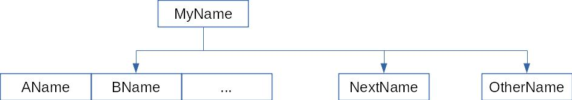

<!-- _class: lead -->

# DB Indexing for performance

---

<!-- _class: lead -->


<!-- We will use mySQL as a mean to provide examples but this should be easily applicable to any other DB -->

---

# We will oversimplify


<!-- In a lot of situations we will do simplifications. This is not an advanced talk -->

---

# Batteries included

You have a docker project that prepares the environment of this talk

[https://github.com/rafadc/talk_indexes](https://github.com/rafadc/talk_indexes)

---

# Your queries become slow

```sql
SELECT * FROM people_small WHERE name="John" AND company = "Mertz-Mertz";

....

took 7ms
```


```sql
SELECT * FROM people_without_indexes WHERE name="John" AND company = "Mertz-Mertz";

....

took 3.8s
```

<!-- Normally queries don't start slow. They gradually degrade through time -->

---

<!-- _class: lead -->


# Indexes

<!-- Image attribution: https://www.flickr.com/photos/gotcredit/33756630285/in/photolist-TqXy7Z-41UtU-65pRH6-74qEZ5-74qFbQ-74qERU-74qEHb-74mLdZ-74mL4v-4rcRjS-74qF5N-Mcgq6s-25XMDFQ-29iao55-29jdUEd-e85NKw-29nixZp-4VJpnq-e85P8w-bfVCgn-bfVwrr-bfVypK-6wwm7H-66kvGn-KKAUxv-PNbZEk-LVgyVT-ejfuDg-oi246q-bfVogR-bfVqsH-bfVskt-bfVub2-bfVAyT-wLoYGz-4GX4gt-G3ANZh-omNTSx-ok1QQ7-o3yiZK-ojRrsL-o3yhNX-ok1Qzh-omNSkV-o3y2Wd-ojLeGZ-o3ykPA-L4gQTo-LemtJ2-od3DLC -->

---

# Index

A DB structure to retrieve values more quickly

---

# Force index

```sql
SELECT *
FROM people_multi_column_index
USE INDEX (people_multi_column_index_happy_name_IDX)
WHERE name = "john" AND happy = true;
```

---

# ANALYZE TABLE

Performs a key distribution analysis and stores the distribution for the named table or tables

```sql
ANALYZE TABLE people_single_index;
```

Remember to run when changing indexes in your playground

<!-- So remember to analyze table when creating indexes in your playground -->

---

# Explain plans

The basic mechanism to understand how the query optimizer will run your query

```sql
EXPLAIN SELECT * FROM people_without_indexes WHERE name="John" AND company = "Mertz-Mertz";
```

```shell
id|select_type|table                 |partitions|type|possible_keys|key|key_len|ref|rows   |filtered|Extra      |
--|-----------|----------------------|----------|----|-------------|---|-------|---|-------|--------|-----------|
 1|SIMPLE     |people_without_indexes|          |ALL |             |   |       |   |9417967|       1|Using where|
```

---

# Reading an explain plan

```shell
id|select_type|table                 |partitions|type|possible_keys|key|key_len|ref|rows   |filtered|Extra      |
--|-----------|----------------------|----------|----|-------------|---|-------|---|-------|--------|-----------|
 1|SIMPLE     |people_without_indexes|          |ALL |             |   |       |   |9417967|       1|Using where|
```

- *type*: Type of join to access the table
- *possible_keys*: Indexes that are applicable to your query
- *key*: Index that mySQL decided that is the best for this query
- *rows*: Estimation of rows to be examined
- *filtered*: Percentage of rows filtered by conditions
- *extra*: More information on how the index works

---

<!-- _class: lead -->


# Single column indexes

<!-- Image attribution: https://www.flickr.com/photos/o_0/26278975918 -->

---

# BTrees



---

# Cardinality

Uniqueness of values stored in a specified column within an index
An index is more effective the more rows it can discard

<!-- The primary key has cardinality equal to the number of rows. That makes it the most effective index to access individually -->

---

# Costs of maintaining an index

- Storage space
- Insertion time

<!-- In mySQL we can check the performance schema to cleanup indexes -->


---
<!-- _class: lead -->

# Multiple column indexes


---

# Multiple column indexes

Sometimes we have not enough with filtering in only one column
The order of the index fields is paramount

---

# Put first the column that will remove the most values

```sql
SELECT *
FROM people_multi_column_index
USE INDEX (people_multi_column_index_happy_name_IDX)
WHERE name = "john" AND happy = true;
```

---

# Put first the column that will remove the most values

```sql
SELECT *
FROM people_multi_column_index
WHERE name = "john" AND happy = true;
```

---

# The range condition of the query should be the last one

```sql
SELECT *
FROM people_multi_column_index
USE INDEX (people_multi_column_index_date_of_birth_name_IDX)
WHERE name = "john" AND date_of_birth > "2000-01-01";
```

<!-- If you think on the BTree structure we cannot use a range and then another value -->

---

# The range condition of the query should be the last one

```sql
SELECT *
FROM people_multi_column_index
WHERE name = "john" AND date_of_birth > "2000-01-01";
```

---

# Like queries are range queries

Same rules as with a regular range query apply

---

# A LIKE %something query cannot use the index

```sql
EXPLAIN SELECT * FROM people_single_index WHERE name LIKE "%John";
```

```
id|select_type|table              |partitions|type|possible_keys|key|key_len|ref|rows   |filtered|Extra      |
--|-----------|-------------------|----------|----|-------------|---|-------|---|-------|--------|-----------|
 1|SIMPLE     |people_single_index|          |ALL |             |   |       |   |9676556|   11.11|Using where|
 ```

---

# Turning range queries into specific value queries

``` sql
SELECT * WHERE A > 1 AND A < 3
```

into

``` sql
SELECT * WHERE A IN (1, 2, 3)
```


---

# Tricking your users to use your indexes more frequently

- Make values mandatory
- Put wise defaults

---

<!-- _class: lead -->

# Sorting


---

# More info


